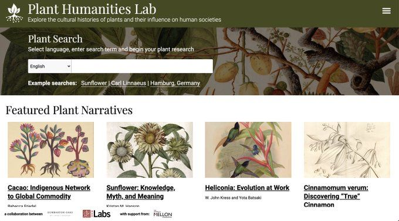
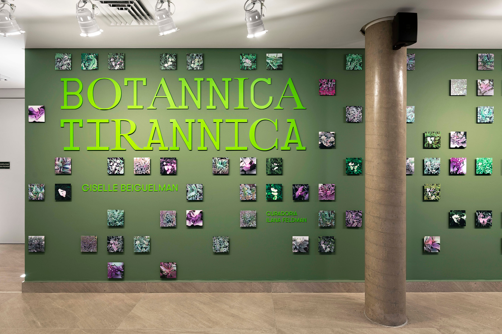
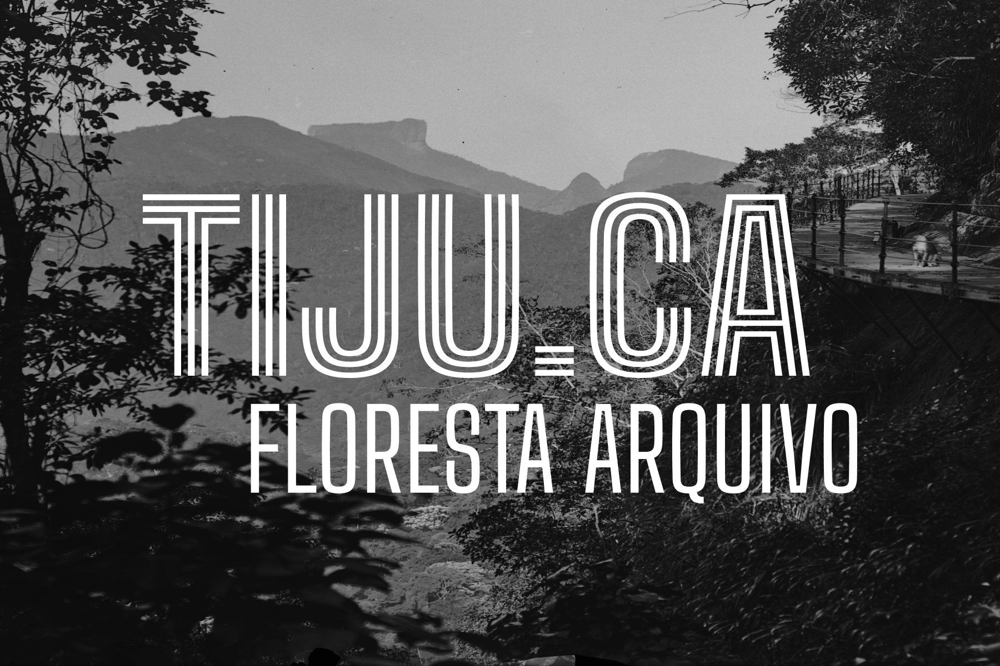
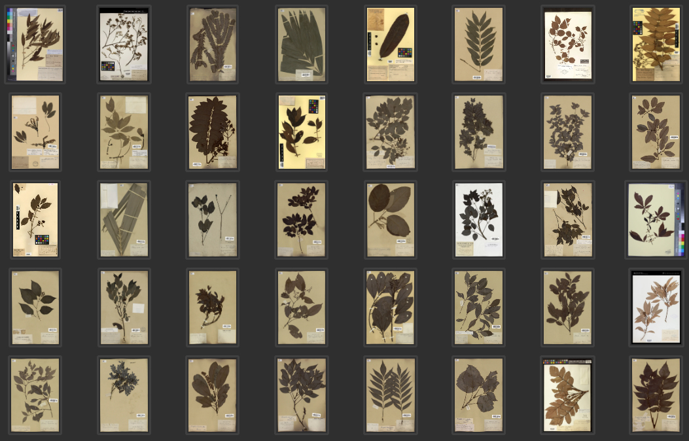
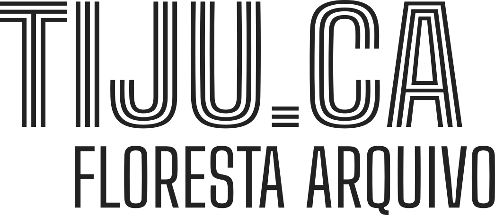

# História Ambiental Digital: Criando narrativas interativas com acervos da biodiversidade

Oficina oferecida pelo Programa de Pós-Graduação em História Política e Bens Culturais e pelo Laboratório de Humanidades Digitais do CPDOC/FGV, com financiamento da FAPERJ.

__18 e 25 de outubro de 2024, das 14h às 17h__ - _(online/zoom)_

[Inscrições aqui](https://cpdoc.fgv.br/2024-oficinas-pphpbc)

[Bruno Buccalon](https://bruno.land/) doutorando em história na Rice University e na Unicamp, pesquisa a criação do Parque Nacional da Tijuca. Atualmente participa do programa de trainee do Getty Research Institute. 

### Dia 1: Acervos da biodiversidade

- Boas-vindas e introdução
- Objetivos e programação da oficina
- Apresentação dos participantes
- Acervos da biodiversidade
- Discussão e exercício

### Dia 2: Ferramentas narrativas

- Recapitulação da aula anterior
- História ambiental digital
- IIIF nos acervos da biodiversidade
- Ferramentas de narrativas
- Mão na massa
- Discussão e próximos passos

---

## Apresentação

A oficina proporciona uma visão abrangente dos principais acervos digitais para pesquisas em história ambiental, ecologia histórica, geografia histórica, história natural, biologia, meio ambiente e áreas correlatas. O foco será na utilização de documentação histórica para criar narrativas interativas sobre fauna, flora e funga. Serão apresentadas ferramentas de _digital storytelling_ e melhores práticas na reutilização de acervos digitais.

[Plant Humanities Lab](https://lab.plant-humanities.org/) de Dumbarton Oaks

[Botannica Tirannica](https://botannicatirannica.desvirtual.com/) por Giselle Beiguelman

---

## Acervos

Os __acervos da biodiversidade__ são fruto da sistematização dos dados sobre o mundo natural, relacionando arquivos históricos (como herbários e museus de história natural) com informações fruto de pesquisas atuais (materiais genéticos) e a coleta colaborativa de dados (observações de campo). A conexão e análise desses acervos fazem parte do campo da [informática da biodiversidade](https://pt.wikipedia.org/wiki/Inform%C3%A1tica_para_a_biodiversidade).

### GBIF

- [Global Biodiversity Information Facility](https://www.gbif.org/)

### BHL

- [Biodiversity Heritage Library](https://www.biodiversitylibrary.org/)

### Wikimedia

- [Wikidata](https://www.wikidata.org/)
- [Wikimedia Commons](https://commons.wikimedia.org/)

### iNaturalist

- [Diversidade do Parque Nacional da Tijuca](https://www.inaturalist.org/projects/diversidade-do-parque-nacional-da-tijuca)

### CRIA

- [SpeciesLink](https://specieslink.net/search/)
- [Demais projetos](https://www.cria.org.br/projetos)

### Jardim Botânico do Rio de Janeiro

- [JABOT](https://jabot.jbrj.gov.br/)
- [Reflora - Flora e Funga do Brasil](https://reflora.jbrj.gov.br/)
- [Catálogo de Plantas das UCs do Brasil](https://catalogo-ucs-brasil.jbrj.gov.br/)

---

## Narrativas

As narrativas intererativas tem sua origem no campo do jornalismo de dados, frequentemente associadas ao termo amplo _digital storytelling_. Elas podem ser construídas de diversas maneiras, e aqui estão algumas sugestões de ferramentas.

### Juncture

- [Juncture](https://www.juncture-digital.org/)
- [Exemplo (Cedrela odorata L.)](https://www.juncture-digital.org/buccalon/cpdoc-workshop/juncture)

### imagineRio

- [Narrativas do imagineRio](https://narratives.imaginerio.org/pt)
- [Exemplo (Cultura do Café)](https://narratives.imaginerio.org/view/618abaf27aa17b004cadcaf3)

### Syllabus Site

- [Syllabus Site](https://infovis.fh-potsdam.de/syllabus-site/)
- Exemplo (esse site!)

---

## Exercício

Escreva uma narrativa sobre alguma __planta__, __animal__ ou __fungo__ relacionado ao Parque Nacional da Tijuca. Utilize ao menos uma imagem e um documento histórico.

[Tijuca Floresta Arquivo](https://tiju.ca/)

### Objetivo

- Relacionar dados de vários de acervos
- Entender como funciona o [procotolo IIIF](https://medium.com/ecologiadigital/conhecendo-o-iiif-padr%C3%B5es-e-ferramentas-para-publica%C3%A7%C3%A3o-de-imagens-na-web-a62af62a1b36)
- Publicar uma narrativa rascunho

### Instruções

1. Escolha uma __planta__, __animal__ ou __fungo__
2. Procure dados e imagens nos acervos
3. Escolha <ins>uma</ins> ferramenta de narrativa
4. Prepare sua publicação
3. Compartilhe o link

_Amostras de herbário (exsicatas) coletadas no Maciço da Tijuca ao longo do século XIX. Curadoria realizada pelo Departamento de Biologia da PUC Rio._

### Dicas

- Não se preocupe demais com a parte técnica
    -  _Vou te ajudar!_

---

## Galeria

Narrativas criadas pelos participantes da oficina.

[Luciane Barbosa: Jacutinga](https://narratives.imaginerio.org/pt/view/6719b0c9b278c10061567185) (imagineRio)

[Liene Vilhena: Pau Brasil](https://lienevilhena.github.io/Oficina-pau-brasil/) (Syllabus Site)

---

## Fim

Para continuar a conversa: __bruno__@__tiju.ca__

### Leitura complementar

- [imagineRio Narratives](https://journalofdigitalhistory.org/en/article/m734RWDSLo9C) _(Journal of Digital History, 2024)_
- [Visual Storytelling with Maps](https://doi.org/10.14714/CP100.1759) _(Cartographic Perspectives, 2022)_ 
- [Scrollytelling for Beginners](https://medium.com/@scrollyforbeginners/scrollytelling-for-beginners-1-551c5bad9631) _(Medium)_

### Agradecimentos

Suemi Higuchi, Bernardo Hollanda, Bruno Macêdo (FGV); Gabriel Sales, Julia Dodel, Rejan Guedes-Bruni (PUC-Rio); e Martim Passos (Arka).

---

 
[Contato](mailto:buccalon@rice.edu?subject=Workshop%20CPDOC) · *Página criada com [Syllabus Site](https://infovis.fh-potsdam.de/syllabus-site/)*
